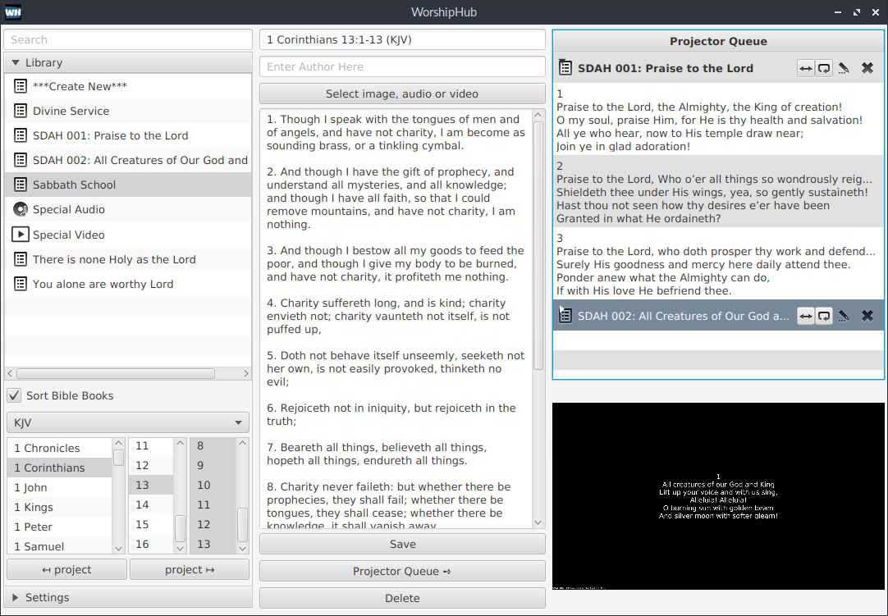

# WorshipHub

This is a church projection application

### What

This, in a lot of ways, is a rewrite of https://github.com/iyobo/epicworship - with a hopefully simpler ui (read as no tabs) and in Kotlin instead of java (more on this below). 

EpicWorship is an excellent application and I recommend it to anybody looking for a free worship projection tool. 
My church used it for 2 or 3 years with no unknown issues popping up. 

### Why

If EpicWorship was/is so cool - why create another version of it? 

* I had to edit the fxml file for EpicWorship to simplify the UI (remove tabs) for non-techie folks in my church. 
* Per https://github.com/iyobo/epicworship/commit/31a89ef5fa4f6efea72acbfbdaf28f4bff56635e, Iyobo switching to nodejs more or less means EpicWorship, in it's current iteration, has no the future. I've honestly looked at other presentation tools but the folks in my church really like the simpler EpicWorship UI.
* Sometime in Dec 2018, I decided to bite the bullet and learn Kotlin so I figured I'd rewrite/update EpicWorship in Kotlin as a pet project. I'm still pretty much a kotlin newb as you'll see in how much the code looks like Java code sometimes.
* This project also gave me the opportunity to try out new features like modules and jpackage in java9 upwards
* The bulk of my dev experience has been as a non-desktop backend developer. This just felt like a fun project to work on a feature-rich desktop application. 

My church now uses WorshipHub instead of EpicWorship full time but I've shied away from putting the code on-line because there have always been one or two issues to resolve. Honestly don't know if I'll get to those so I'm putting it out here anyway.

### Downloads/Builds

These downloads include the java jvm so you should be able to simply double-click on the executable file within the tarball/zip file to run the application

* windows: [https://www.dropbox.com/s/iacj4mpftrg02k3/worshiphub.0.0.0.windows.zip?dl=0](https://www.dropbox.com/s/iacj4mpftrg02k3/worshiphub.0.0.0.windows.zip?dl=0)
* linux: [https://www.dropbox.com/s/yf5csmw1fzjpzm6/worshiphub.0.0.0.linux.tar.gz?dl=0](https://www.dropbox.com/s/yf5csmw1fzjpzm6/worshiphub.0.0.0.linux.tar.gz?dl=0)
* mac: For Mac, use the steps below to build the application

### How to build

* Clone or download this repo
* Download java-14  - you need this for jpackage
* make sure you have maven installed on or downloaded to your laptop
* from the repo directory, run the following command `mvn clean package -Djpackage=/opt/jdk-14/bin/jpackage` - remember to change jpackage parameter to the location of the unzipped java-14 tarball you downloaded earlier. Same goes for mvn e.g. on windows this is what I run `c:\apache-maven-3.6.3\bin\mvn clean package -Djpackage=c:\jdk-14\bin\jpackage`
* Simply double-click (or click on mac?) the build worshiphub executable

### Other very very important stuff

* The motion file: http://video2.ignitemotion.com/files/mp4/Looping_Clouds.mp4 and https://pixabay.com/videos/particles-turquoise-retro-squares-5156/. There are tonnes of sites to download similar videos free. Google is your friend here (or maybe not)
* The background files in this repo are download from https://www.pexels.com 
* As much as possible where code was lifted from other sources, I've included references to such in the source code
* Bibles are xmm format download from https://sourceforge.net/projects/zefania-sharp/files/Bibles/ENG/ and somewhere else I can't remember right now :(

### Known stuff to think about and features to fix

* The most important is that if the text is too long it will fall outside of the projector screen. At church we currently break up the verses of songs at no more than 7 lines. We find that we could make the font size smaller but at more than 7 lines, the text is too small to read anyway so it's better to break the text into no more than 7 lines.
* I tried showing whitespace in the editor at some point but I never really finished that code so it's mostly crippled on purpose.
* I'll like some kind of theme feature so that, for instance, the text can appear right aligned instead of always centralized, etc.
* I'll like to be able to change the order of items on the projector list e.g. move an hymn above the bible text etc. This was also partially implemented but I left it out eventually
* The buttons and links on the UI could do with a few tooltips
* openjfx doesn't play nice with flv (flash) files on linux - my default os. 
* Also, I didn't test this app at all on mac - my macbook's been dead for almost 2 years now so it is what it is.
* Dialogs should open to the most appropriate folder instead of the installation folder. For instance when changing backgrounds it should open the default OS' picture/image folder at the very least
